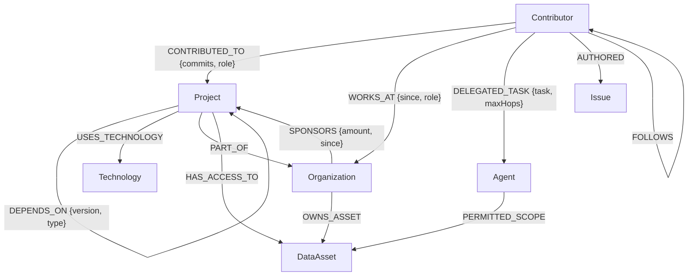
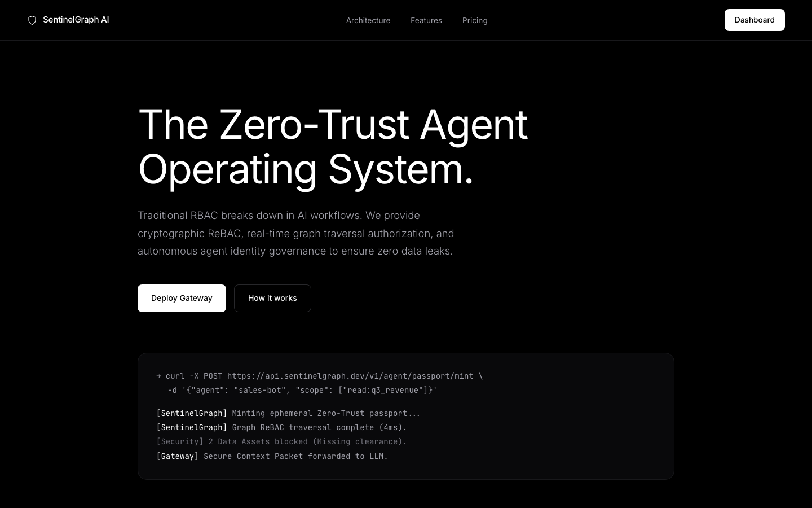
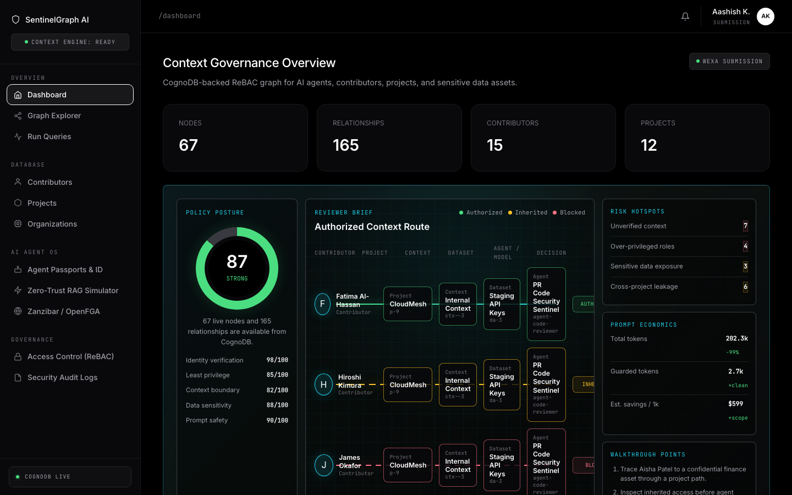
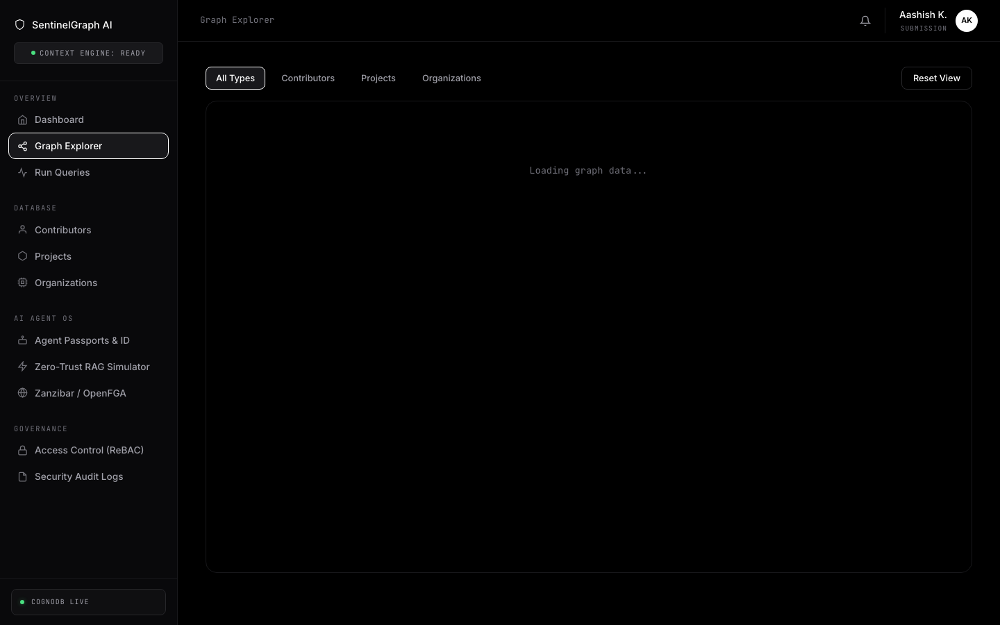
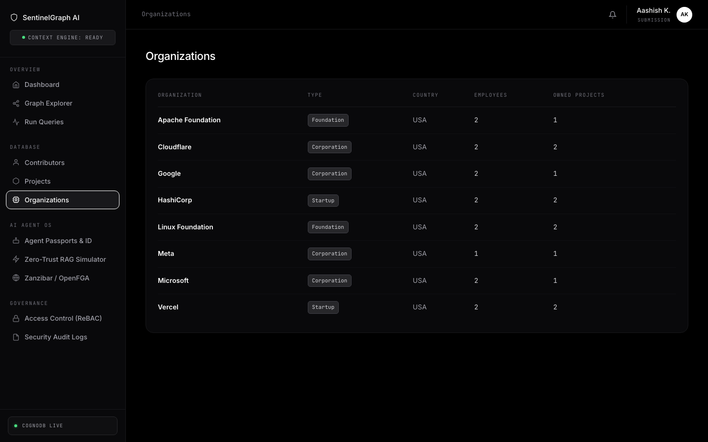

# SentinelGraph AI

Submitted by Aashish KY for the Wexa AI CognoDB assignment.

SentinelGraph AI is a live web application that shows how a company can control what an AI agent is allowed to see. The idea is simple: before an agent gets access to private company data, the app checks whether there is a valid relationship path between the person, project, organization, agent, and data asset.

For example, a finance agent should be able to read finance-related records only when the graph proves the user and agent are connected to that data through an approved path. If that path does not exist, the request is blocked.

## Live Links

- GitHub repository: [github.com/aashishky2/Wexa-AI-Assignment](https://github.com/aashishky2/Wexa-AI-Assignment)
- Live application: [wexaaiassign.vercel.app](https://wexaaiassign.vercel.app)
- Dashboard: [wexaaiassign.vercel.app/dashboard](https://wexaaiassign.vercel.app/dashboard)

## What This App Does

- Shows people, projects, organizations, technologies, agents, and data assets as a connected graph.
- Uses CognoDB to store and query those relationships.
- Answers practical access questions, such as "Can this user access this data?"
- Shows the exact relationship path behind an access decision.
- Compares raw data retrieval with graph-authorized retrieval to show how sensitive context can be protected.
- Includes a polished dashboard that can be explored without using developer tools.

## How To Try It

1. Open [wexaaiassign.vercel.app/dashboard](https://wexaaiassign.vercel.app/dashboard).
2. Confirm the bottom-left status says `COGNODB LIVE`.
3. Open `Graph Explorer` to see the relationship network.
4. Open `Run Queries` and run `Supply-Chain Risk`.
5. Open `Graph-Based Access Control` and test a user-to-data access decision.
6. Open `Zero-Trust RAG Simulator` to compare unrestricted retrieval with graph-authorized retrieval.

## Why A Graph Database?

This project is about relationships, not just rows in a table.

In a normal relational database, answering a question like "Can this person access this private data through their company, project, and delegated agent?" can require many joins and extra logic. In a graph database, the same question is naturally represented as a path:

```text
Contributor -> Organization -> Data Asset
Contributor -> Project -> Data Asset
Contributor -> Agent -> Data Asset
```

CognoDB is a strong fit because it supports graph traversal with openCypher over Bolt. That makes it possible to ask relationship-first questions clearly, such as:

- Which users can reach a sensitive data asset?
- Which projects are connected through dependency chains?
- Which contributors create cross-organization supply-chain risk?
- What exact path explains an allow or block decision?

## Data Model

The graph contains these main node types:

- `Contributor`: a person who works on projects or belongs to an organization.
- `Organization`: a company, foundation, or team.
- `Project`: a software project or internal system.
- `Technology`: a tool or technology used by a project.
- `Agent`: an autonomous worker that can be delegated a task.
- `DataAsset`: sensitive or internal data.
- `Issue`: work items connected to contributors.



The seed data includes realistic contributors, organizations, projects, technologies, issues, agents, and sensitive data assets.

## Screenshots

| Landing page | Dashboard cockpit |
| --- | --- |
|  |  |

| ReBAC graph explorer | Organization hierarchy |
| --- | --- |
|  |  |

The original assignment brief is archived in [docs/wexa-ai-technical-assessment.pdf](docs/wexa-ai-technical-assessment.pdf), with implementation notes in [docs/submission-notes.md](docs/submission-notes.md).

## Tech Stack

- Node.js and Express for the backend.
- CognoDB Cloud as the graph database.
- Official `neo4j-driver` for Bolt/openCypher queries.
- Vanilla HTML, CSS, and JavaScript for the dashboard.
- D3.js for graph visualization.
- Vercel for production hosting.

## Key Queries

### 1. Graph Stats

Shows total graph size for the dashboard.

```cypher
CALL { MATCH (n) RETURN count(n) AS nodeCount }
CALL { MATCH ()-[r]->() RETURN count(r) AS relCount }
CALL { MATCH (c:Contributor) RETURN count(c) AS contributors }
CALL { MATCH (p:Project) RETURN count(p) AS projects }
RETURN nodeCount, relCount, contributors, projects
```

### 2. Multi-Hop Collaboration

Finds contributors connected through shared projects.

```cypher
MATCH path = (start:Contributor {id: $id})-[:CONTRIBUTED_TO*1..2]->(p:Project)<-[:CONTRIBUTED_TO]-(peer:Contributor)
WHERE peer <> start
RETURN peer, collect(DISTINCT p.name) AS sharedProjects, min(length(path)) AS minHops
```

### 3. Supply-Chain Risk

Finds contributors connected to projects that depend on each other across different organizations.

```cypher
MATCH (orgA:Organization)<-[:PART_OF]-(projA:Project)-[:DEPENDS_ON]->(projB:Project)-[:PART_OF]->(orgB:Organization)
WHERE orgA <> orgB
MATCH (c:Contributor)-[:CONTRIBUTED_TO]->(projA)
MATCH (c)-[:CONTRIBUTED_TO]->(projB)
RETURN orgA.name, projA.name, projB.name, orgB.name, c.name
```

### 4. Access Check

Returns the path that explains whether access is allowed.

```cypher
MATCH (c:Contributor {id: $contributorId})
MATCH (d:DataAsset {id: $assetId})
OPTIONAL MATCH p1 = (c)-[:WORKS_AT]->(:Organization)-[:OWNS_ASSET]->(d)
OPTIONAL MATCH p2 = (c)-[:CONTRIBUTED_TO]->(:Project)-[:HAS_ACCESS_TO]->(d)
RETURN p1, p2
```

All user inputs are passed as query parameters through the official Neo4j driver. Cypher strings are not built by joining user input into raw query text.

## Local Setup

1. Create a CognoDB instance at [console.cognodb.com](https://console.cognodb.com/signup).
2. Copy `.env.example` to `.env`.
3. Add your CognoDB values:

```env
COGNODB_URI=bolt+s://YOUR_INSTANCE_ID.databases.cognodb.com
COGNODB_USER=cognodb
COGNODB_PASSWORD=your_generated_password_here
PORT=3000
NODE_ENV=development
AGENT_SECRET_KEY=replace_with_a_long_random_secret
```

4. Install dependencies:

```bash
npm ci
```

5. Seed the graph:

```bash
npm run seed
```

6. Start the app:

```bash
npm run dev
```

Open [http://localhost:3000/dashboard](http://localhost:3000/dashboard).

## Useful Commands

```bash
npm start                 # Start the Express server
npm run dev               # Start the local development server
npm run seed              # Load seed data into CognoDB
npm test                  # Run backend health and graph response tests
npm run test:agent-governance
```

## Main API Endpoints

| Method | Endpoint | Purpose |
| --- | --- | --- |
| `GET` | `/api/health` | Checks service and CognoDB connection status |
| `GET` | `/api/graph/stats` | Returns total graph counts |
| `GET` | `/api/graph/overview` | Returns graph data for visualization |
| `GET` | `/api/contributors` | Lists contributors |
| `GET` | `/api/projects` | Lists projects |
| `GET` | `/api/organizations` | Lists organizations |
| `GET` | `/api/queries/collaboration-network/:id` | Shows contributor collaboration paths |
| `GET` | `/api/queries/supply-chain-risk` | Shows cross-organization dependency risk |
| `GET` | `/api/queries/dependency-chain/:id` | Shows project dependency chains |
| `GET` | `/api/queries/shortest-path` | Finds the shortest path between two graph nodes |
| `GET` | `/api/auth/check-access` | Explains whether a user can access a data asset |
| `POST` | `/api/agent/passport/mint` | Creates a scoped agent passport |
| `POST` | `/api/agent/simulate-rag` | Compares unrestricted retrieval with graph-authorized retrieval |

## Deployment

The project is deployed on Vercel. Production requires these environment variables:

- `COGNODB_URI`
- `COGNODB_USER`
- `COGNODB_PASSWORD`
- `AGENT_SECRET_KEY`

The live deployment is connected to CognoDB and can be opened at [wexaaiassign.vercel.app/dashboard](https://wexaaiassign.vercel.app/dashboard).

## Assignment Checklist

- Full source code is included.
- CognoDB is used as the graph database.
- Seed script is included in [server/seed/seed.js](server/seed/seed.js).
- Query values are parameterized through `neo4j-driver`.
- Multi-hop graph traversal is included.
- A relationship-heavy query is included for supply-chain risk.
- README includes the use case, graph rationale, data model, setup steps, queries, screenshots, and deployment details.
- Live Vercel deployment is included.
