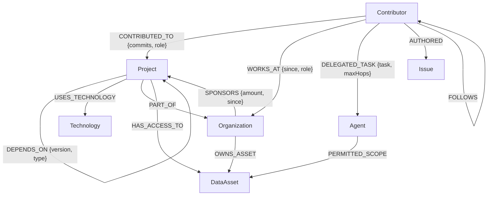

# SentinelGraph AI

SentinelGraph AI is a CognoDB-backed graph application for exploring zero-trust context governance for enterprise AI agents. It models people, projects, organizations, technologies, autonomous agents, and sensitive data assets as a live relationship graph, then uses openCypher traversals to answer questions such as:

- Which data assets can this user or delegated agent reach?
- Which contributors create cross-organization supply-chain risk?
- What dependency chain connects one project to another?
- How much context would raw RAG leak compared with graph-authorized retrieval?

The application includes a polished web dashboard, a seed script, parameterized Cypher queries through the official Neo4j JavaScript driver, and clear service health responses for the live CognoDB connection.

The home dashboard includes a submission brief summarizing the graph posture, risk hotspots, and prompt-context savings so the end-to-end use case is visible immediately after opening the demo.

## Live Demo

- GitHub repository: [github.com/aashishky2/Wexa-AI-Assignment](https://github.com/aashishky2/Wexa-AI-Assignment)
- Vercel demo: [wexaaiassign.vercel.app](https://wexaaiassign.vercel.app)
- Dashboard: [wexaaiassign.vercel.app/dashboard](https://wexaaiassign.vercel.app/dashboard)

The project is configured for Vercel with `vercel.json`. The production deployment uses the live CognoDB instance through environment variables and opens directly to `/dashboard`.

## Why a Graph Database?

This problem is about reachability and proof paths, not flat rows. A relational schema can store users, projects, organizations, and assets, but answering "can this agent see this asset through delegation, organization membership, and project access?" quickly becomes a chain of joins and recursive logic.

CognoDB is a good fit because:

- ReBAC checks are native path traversals such as `(Contributor)-[:WORKS_AT]->(Organization)-[:OWNS_ASSET]->(DataAsset)`.
- Multi-hop dependency and collaboration questions stay readable in Cypher.
- The UI can show the actual path used to grant or deny access, which is valuable for auditability.
- New relationship types, such as `DELEGATED_TASK` and `PERMITTED_SCOPE`, can be added without redesigning rigid join tables.

## Graph Data Model



Seed data includes realistic open-source contributors, projects, organizations, technologies, issues, autonomous agents, and sensitive data assets.

## Screenshots

| Landing page | Dashboard cockpit |
| --- | --- |
|  |  |

| ReBAC graph explorer | Organization hierarchy |
| --- | --- |
|  |  |

The original assessment brief is archived in [docs/wexa-ai-technical-assessment.pdf](docs/wexa-ai-technical-assessment.pdf), with implementation notes in [docs/submission-notes.md](docs/submission-notes.md).

## Tech Stack

- Node.js and Express
- CognoDB Cloud over Bolt using the official `neo4j-driver`
- Vanilla HTML/CSS/JavaScript dashboard
- D3.js graph visualization
- Vercel serverless API support

## Local Setup

1. Create a free CognoDB instance at [console.cognodb.com](https://console.cognodb.com/signup).
2. Copy `.env.example` to `.env`.
3. Fill in the CognoDB connection values:

```env
COGNODB_URI=bolt+s://YOUR_INSTANCE_ID.databases.cognodb.com
COGNODB_USER=cognodb
COGNODB_PASSWORD=your_generated_password_here
PORT=3000
NODE_ENV=development
```

4. Install dependencies:

```bash
npm ci
```

5. Seed the graph:

```bash
npm run seed
```

6. Start the app:

```bash
npm run dev
```

Open [http://localhost:3000/dashboard](http://localhost:3000/dashboard).

## Scripts

```bash
npm start                 # Start the Express server
npm run dev               # Start with nodemon for development
npm run seed              # Load seed data into CognoDB
npm test                  # Run the health/degraded-state regression test
npm run test:agent-governance
```

## Main Queries

### Graph Stats

Counts graph-wide node and relationship totals for the dashboard.

```cypher
CALL { MATCH (n) RETURN count(n) AS nodeCount }
CALL { MATCH ()-[r]->() RETURN count(r) AS relCount }
CALL { MATCH (c:Contributor) RETURN count(c) AS contributors }
CALL { MATCH (p:Project) RETURN count(p) AS projects }
RETURN nodeCount, relCount, contributors, projects
```

### Multi-hop Collaboration Network

Finds contributors connected through shared projects. This exercises variable-length traversal.

```cypher
MATCH path = (start:Contributor {id: $id})-[:CONTRIBUTED_TO*1..2]->(p:Project)<-[:CONTRIBUTED_TO]-(peer:Contributor)
WHERE peer <> start
RETURN peer, collect(DISTINCT p.name) AS sharedProjects, min(length(path)) AS minHops
```

### Supply-chain Risk

Finds contributors working across projects that depend on each other across organization boundaries. This is awkward in a relational schema because it combines dependency reachability, org ownership, and contributor overlap.

```cypher
MATCH (orgA:Organization)<-[:PART_OF]-(projA:Project)-[:DEPENDS_ON]->(projB:Project)-[:PART_OF]->(orgB:Organization)
WHERE orgA <> orgB
MATCH (c:Contributor)-[:CONTRIBUTED_TO]->(projA)
MATCH (c)-[:CONTRIBUTED_TO]->(projB)
RETURN orgA.name, projA.name, projB.name, orgB.name, c.name
```

### ReBAC Access Check

Returns an explainable authorization path from contributor to sensitive asset.

```cypher
MATCH (c:Contributor {id: $contributorId})
MATCH (d:DataAsset {id: $assetId})
OPTIONAL MATCH p1 = (c)-[:WORKS_AT]->(:Organization)-[:OWNS_ASSET]->(d)
OPTIONAL MATCH p2 = (c)-[:CONTRIBUTED_TO]->(:Project)-[:HAS_ACCESS_TO]->(d)
RETURN p1, p2
```

All user-supplied values are passed as query parameters through the Neo4j driver; Cypher strings are not concatenated with request input.

## API Overview

| Method | Endpoint | Purpose |
| --- | --- | --- |
| `GET` | `/api/health` | Service and CognoDB connectivity health |
| `GET` | `/api/insights/context-brief` | Submission-ready governance summary |
| `GET` | `/api/insights/context-route` | Authorized context route proof for the dashboard cockpit |
| `GET` | `/api/graph/stats` | Aggregate graph counts |
| `GET` | `/api/graph/overview` | D3 graph payload |
| `GET` | `/api/contributors` | Contributor ranking |
| `GET` | `/api/projects` | Project catalog |
| `GET` | `/api/organizations` | Organization catalog |
| `GET` | `/api/queries/collaboration-network/:id` | Multi-hop contributor graph |
| `GET` | `/api/queries/supply-chain-risk` | Cross-org dependency risk |
| `GET` | `/api/queries/dependency-chain/:id` | Variable-length dependency traversal |
| `GET` | `/api/queries/shortest-path` | Shortest path between graph entities |
| `GET` | `/api/auth/check-access` | ReBAC path authorization |
| `POST` | `/api/agent/passport/mint` | Mint delegated agent passport |
| `POST` | `/api/agent/simulate-rag` | Raw RAG vs graph-authorized retrieval demo |

## Deployment

### Vercel

The repo includes `vercel.json` for the Express serverless API and dashboard route. Live CognoDB traversal requires the environment variables below.

1. Import the GitHub repo into Vercel.
2. Add these environment variables in Vercel Project Settings:
   - `COGNODB_URI`
   - `COGNODB_USER`
   - `COGNODB_PASSWORD`
   - `AGENT_SECRET_KEY`
3. Deploy.
4. Open `/dashboard`.
5. Run `npm run seed` locally against the same CognoDB instance before recording the demo.

## Reliability

When CognoDB is unavailable, `/api/health` returns `503` with `status: "degraded"` and `db: "standby"`. When the CognoDB variables are present and reachable, the API uses parameterized Cypher through the official Neo4j driver.

## Assignment Checklist

- Full source code included.
- Seed script included in `server/seed/seed.js`.
- CognoDB connection read from environment variables.
- Parameterized Cypher queries through `neo4j-driver`.
- Multi-hop traversal and graph-native queries included.
- README includes use case, graph rationale, diagram, setup, queries, screenshots, and deployment instructions.
- Live Vercel deployment included.
- Screen recording should be recorded from the hosted dashboard.
